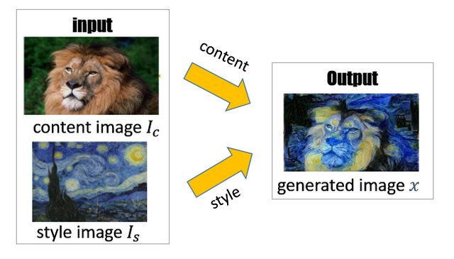

<h2>Generative Adversarial Nets (GANs) Example</h2>

This notebook is a demo of training a Generative Adversarial Networks (GANs) to transfer the style of one image to the content of another image.

Notebook is rendered best in nbviewer [here](http://nbviewer.ipython.org/urls/raw.github.com/brianspiering/generative_adversarial_networks_example/main/style_transfer_demo.ipynb)